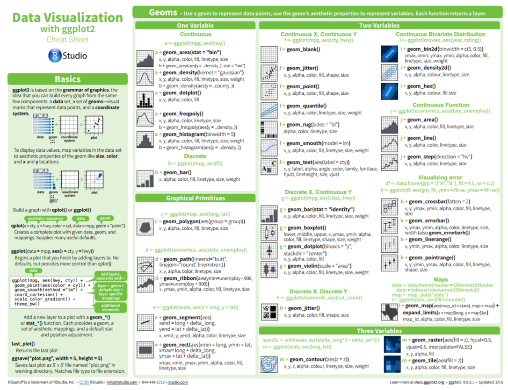
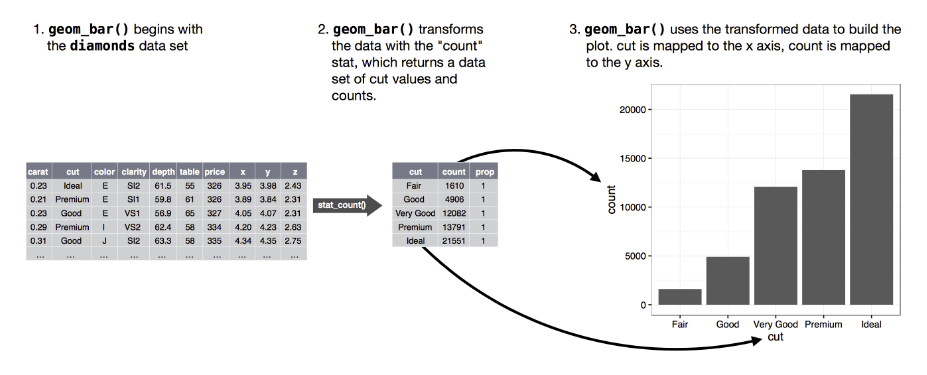

```{r, include=FALSE}
require(knitr)
knitr::opts_chunk$set(message=FALSE, warning=FALSE, cache=FALSE)

```

## Aims and objectives

### Aim:

Expose you to the "grammar of graphics", to allow you create fancy charts in R

### Objectives:

- Introduce ggplot2
- Understand the grammar of constructing charts
- Practice creating plots yourself
- Signpost resources

## R Resources
- This workshop is based on the free eBook "R for Data Science" http://r4ds.had.co.nz (reproduced here under CC BY-NC-ND 3.0 US license)

- It covers all the basic usage of R and is pretty up to date.

## Part 1

The topics for this first part will include the following:

   - Basic R Plotting
   - Grammar of Graphics basics
   - Aesthetics
   - Facets
   - Geoms

## Basic plots
- Base R has some basic plotting functionality, as illustrated here and on the following slide. However, it's quite limited in facility, and the current standard is to use the ggplot2 library, which provides a powerful grammar for creating charts.

Should you need them, the built in plot features can be called with

- Scatter: `plot()`
- Histogram: `hist()`
- Boxplot: `boxplot()`

----------

```{r}
#Basic Plot
plot(rnorm(20), rnorm(20))
```

# GGplot2 - Basics

## Grammar of graphics
Plots in R are now mostly made using GGplot2.

Follows the "grammar of graphics" principle that plots can be made up from:

- Geometric objects (called 'geoms' in ggplot2)
- Scales
- Coordinate system
- Annotations


-----

ggplot2 is a part of the Tidyverse, a popular collection of packages designed for data science. You can load it in R as so:

```{r, highlight=TRUE}
# load ggplot2 library as part of tidyverse  
library(tidyverse)
```

Alternatively you can import ggplot2 directly:

```{r, highlight=TRUE}
# load ggplot2 library on its own

library(ggplot2)
```


## Loading the data

For this intro we'll use the dataset `mpg`, which is included in the ggplot2 package. It contains information on cars fuel efficiency. We can use `glimpse(mpg)` or `head(mpg)` or `mpg` to have a quick look at the data.   
```{r}
#load the mpg dataset

data(mpg) #load the mpg dataset
glimpse(mpg)
```

`displ` contains the cars engine size
`hwy` contains the cars fuel efficiency on the motorway, low scores = more fuel consumption

## Graphing template

The basic pattern of a ggplot function looks like this:

```{r eval = FALSE}
## ggplot blueprint to making any plot
ggplot(data = <DATA>) + 
  <GEOM_FUNCTION>(mapping = aes(<MAPPINGS>))
```

A ggplot object must contain

- the data to be plotted
- how that data should be mapped to the coordinate system, defined using `aes()` (short for aesthetics).
- a geometric to draw the aesthetics with

---

- ggplot works with layers, each layers is added with the `+` operator.
- Mappings are always added using the `aes()` command, which can be inside the `ggplot()` or `geom`.

```{r, eval=FALSE}
# ggplot works with layers, each layers is added with the `+` operator.
ggplot(data = mpg, aes(x=displ, y=hwy))+
  geom_point()
```

```{r, fig.height=3, fig.width=4}
ggplot(data = mpg)+
  geom_point(aes(x=displ, y=hwy))
```

## Exercises: Section 1

1. Run `ggplot(data=mpg)` what do you see?
2. What does the `drv` variable describe? Read the help for mpg data set to find out by running `?mpg`
3. Make a scatter plot of `hwy` vs. `cty`
4. Make a scatter plot of `class` vs. `drv`. Why isn't this plot useful?

### Extension

To fix the problem with exercise 4, make a scatter plot of `class` vs `cty` and colour the points by `drv` (more on this in the next section)

## Aesthetics

There are plenty of ways to map aesthetics in ggplot.

For example, we could set the colour of the point to be determined by the vehicle class.
```{r, fig.height=3, fig.width=6}
# Aesthetics
ggplot(data = mpg, aes(x=displ, y=hwy, colour=class))+
  geom_point()
```

---

ggplot does some clever things when deciding what colours to use - for factorial variables it will assign each factor a unique colour, whilst for continuous variables it will assign a colour scale. These can be customized (we'll cover this later).

```{r}
# ggplot does some clever things when deciding what colours to use
ggplot(data = mpg, aes(x=displ, y=hwy, colour=year))+
  geom_point()
```

---

You can also use shapes to distinguish between categories, such as class.

But, what's wrong with this plot?
```{r}
# You can also use shapes to distinguish between categories, such as class.
ggplot(data = mpg, aes(x=displ, y=hwy, shape=class, colour=class))+
  geom_point()
```


---

Some aesthetics are only suitable in certain situations. For example, using `shape` for `class` isn't appropriate as, by default, shape only supports 6 distinct categories (you can override this manually). Notice what has happened to SUV here:
```{r}
#Some aesthetics are only suitable in certain situations
ggplot(data = mpg, aes(x=displ, y=hwy, shape=class, colour=class))+
  geom_point()
```

---

You can also specify things manually. Hint use `colors()` to get the list of built in colours. Use hex values for any colour `'#28b7b7'`. 

```{r, fig.height=3, fig.retina=2}
#You can also specify things manually

ggplot(data = mpg %>% filter(manufacturer %in% c('audi', 'volkswagen')), 
       aes(x=displ, y=hwy, colour=manufacturer, shape = manufacturer))+
  geom_point(size=3)+
  scale_color_manual(values = c("audi" = "#28b7b7", "volkswagen"="violet"))+
  scale_shape_manual(values = c("audi" = 1, "volkswagen" = 24))
```

---
You don't *have* to map aesthetics onto variables; you can specify them manually. For example, you can define the colour of the points:

```{r}

#You don't *have* to map aesthetics onto variables; you can specify them manually.
#
ggplot(data = mpg, aes(x=displ, y=hwy))+
  geom_point(color = "orange")
```

---

## Exercises: Section 2

### 1

- What's wrong with this code? Why aren't the points blue?

```{r, fig.height=2, fig.width=5}
#What's wrong with this code? Why aren't the points blue?

ggplot(data = mpg)+
  geom_point(aes(x=displ, y=hwy, color = "blue"))
```

### 2 
- Map a continuous variable to `color`, `size` and `shape`. How do these aesthetics behave differently for categorical vs. continuous variables? Hint: use `glimpse(mpg)` to identify variable types.

### 3
- What happens if you map the same variable to multiple aesthetics?

### 4
- What happens if you map an aesthetic to something other than a variable name, like a Boolean statement `aes(colour = displ <5)`

## Facets

Facets are a useful way to separate out variables into subplots.

There are two ways of doing this; `facet_wrap()` or `facet_grid()`. The main argument here is an R 'formula', where the faceted variable is preceded by a tilde ~ (e.g. ~class). To facet multiple variables, they can be separated by a tilde (e.g. drv ~ cyl)

```{r, fig.height=3}
ggplot(data = mpg, aes(x=displ, y=hwy))+
  geom_point()+
  facet_wrap(~ class, nrow=2)
```

---

You can lay out multiple facets in a grid:

```{r}
ggplot(data = mpg, aes(x=displ, y=hwy))+
  geom_point()+
  facet_grid(drv ~ class)
```


# Other geoms

## Geoms
There are tons of geoms available in ggplot - the best resource for choosing an appropriate geom is the cheat sheet. This can be found at https://github.com/rstudio/cheatsheets/raw/master/data-visualization-2.1.pdf

```{r, echo=FALSE, out.width="600px"}

```

## geom_smooth()

geom_smooth() takes data points and returns a linear model with confidence intervals. For example, if we just replace `geom_point()` with `geom_smooth()`, we get a loess curve.  

```{r, fig.height=4}
ggplot(data = mpg, aes(x=displ, y=hwy))+
  geom_smooth()
```

---

We can add the points as well, using the + operator; and have added a line break using `geom_line` with a constant x value (this can be used for example to show a significant event in a time series). Note that the order of layers determines their order on the plot. As points are after the smooth line, they will be draw on top (and obscure) the line. 

```{r, fig.height=4}

# We can add the points as well, using the + operator
# 
ggplot(data = mpg, aes(x=displ, y=hwy))+
  geom_smooth()+
  geom_point() +
  geom_line(aes(x = 4.5))
```

## Exercise: Section 3

### 1

**Can you reproduce this plot?** 
Note that the points vary in `color` based on the cars `class` but the smooth line does not.

```{r, fig.height=3, echo=FALSE}

# Note that the points vary in `color` based on the cars `class` but the smooth line does not.
# 
ggplot(data = mpg, aes(x=displ, y=hwy))+
  geom_smooth()+
  geom_point(aes(color=class))
```

### Extension

Try removing the confidence interval from the smooth line. Also try changing the linetype to dashed or dotted.

## Part 2

The topics for the second part will include:

   - Stats and Geoms
   - Example using Bar Charts
   - Chart Positioning 
   - Themes, titles and Multiple Plots
  
---

## Stats and Geoms

Both geoms and stats can be used to make plots in the R package ggplot2, and they will give corresponding results. The difference between geoms and stats can be summarized as follows:

- geoms stand for 'geometric objects' - these are the core elements that you see on the plot; objects like lines, curves, points, areas.

- stats stand for 'statistical transformations' - these objects summarize the data in different ways, to map the data to the chosen geom in the chosen way

In general, equivalent plots can be created using either a 'stat' layer or a 'geom' layer. **Every geom has a default stat, and every stat has a default geom.** The majority of the time, you will find it easiest to use a geometric object, and use the default stat. However, this concept is introduced here as is important if looking to create more bespoke or advanced charts.

For most of the time you will want to use the default stat for a chosen geom (or vice versa), but sometimes we will want to specify this explicitly, as in the next example, which illustrates one of the situations where we may want to use a stat object, rather than geom.

---

As an example, the stat `stat_summary` is the statistical transformation that provides a statistical summary of the chosen variable, including mean/median/mode, max/min, quartiles. The default geom for this stat is the `geom_pointrange` - which shows the median value as a point, and lines to indicate the range of values recorded by the variable.

Thus we can create the same graph using two different approaches in ggplot:

**1 - stat_summary**
```{r, fig.height = 2.5}

# we can create the same graph using two different approaches in ggplot

ggplot(data = mpg)+
  stat_summary(mapping = aes(x = class, y = hwy),
               fun.ymin = min, fun.ymax = max,
               fun.y = median)
```

---

Note that when using stat_summary we also have to select what function we want to apply to the y variable - here we are looking at the range of values around the median, and specify functions as appropriate. When using stat_summary in general you will need to specify a function transformation for the y variable (this is not always true of other stats).

The same graph can be created using the geom command:

**2 - geom_pointrange**
```{r, fig.height = 2.5}

# The same graph can be created using the geom command
# 
ggplot(data = mpg)+
  geom_pointrange(mapping = aes(x = class, y = hwy),
                  fun.ymin = min, fun.ymax = max, 
                  fun.y = median,
                  stat = "summary")
```

## Bar charts
Some geoms plot raw data (like `geom_point()`) others perform transformations in the background. We've already seen this with `geom_smooth()`. Look at what happens when we plot a bar chat of vehicle class.

```{r, fig.height=2}
#Bar charts

ggplot(data=mpg, aes(x=class))+
  geom_bar()
```

Rather than returning every observation, ggplot has summarized the data using the count statistic. This is because this is the default behavior for a bar chart - `stat_count` is the default stat for `geom_bar`. The same chart can therefore be produced using `ggplot(data=mpg, aes(x=class)) + stat_count()`. 

---

```{r, echo=FALSE, out.width = "800px", out.height = "400px"}

```

You may not want to use the default stat... you can override the defaults by specifying a stat. Stats can be called as we have already seen using `stat_` to specify the statistical transformation.

In cases where we just have an x variable (e.g. for a simple bar chart), we can also just specify the stat we want as a y co-ordinate mapping. For example, in the aes mapping we simply call `y = stat(count)` for a basic count of the x variable, `y = stat(mean)` for the mean, `y = stat(prop)` for the proportion of observations in each x category, etc.

# Positioning

## Bar chart positioning

What is wrong with this chart?

Note: With bar charts, `fill=` determines the colour inside the bar and `colour=` controls the lines around the bar.

```{r, fig.height=3}

# Bar chart positioning
# 
ggplot(data=mpg, aes(x=manufacturer, fill=class))+
         geom_bar(color='black')+
  theme(axis.text.x = element_text(angle=90, vjust = 0, hjust=1))
```

---

By default bars are "stacked" on top of each other. This makes comparing proportions rather difficult. You can control this with the position argument. 'dodge' places bars next to each other, whilst 'fill' makes them all the same length (to allow for easier comparison).

```{r, fig.height=3}

#By default bars are "stacked" on top of each other. This makes comparing proportions rather difficult. You can control this with the position argument

ggplot(data=mpg, aes(x=manufacturer, fill=class))+
         geom_bar(color='black', position='dodge')+
  theme(axis.text.x = element_text(angle=90, vjust = 0, hjust=1))
```

---

## Exercises: Section 4

1. Using the mpg dataset create a bar chart showing a count of the dataset grouped by 'class' of car.

2. Now specify a y co-ordinate mapping to show the average fuel displacement (displ) of each 'class' of car. 

*Hint* you will need the following arguments inside the 'geom_bar' call (as well as your x and y mapping):

```{r, eval=FALSE, results=FALSE}
stat = "summary", fun.y = "mean"
```

 3. Add a fill to the bars to show the average split by the type of drive of each class of car. 

*Hint* you will need to specify the position of the bars in order for this to make sense

---

What is wrong with this plot?

```{r}
# What is wrong with this plot?
# 
ggplot(data=mpg, aes(x=cty, y=hwy))+
  geom_point()
```

---

Because there are multiple observations, some are **overplotted**. To correct this, you can add some random noise to the data with `position="jitter"` or `geom_jitter`. This is a bit of a compromise - you either have a chart that is accurate but suffers from over plotting, or one that contains some random noise but reveals the size of the data.

```{r, fig.height=3}
# Because there are multiple observations, some are **overplotted**.
#  To correct this, you can add some random noise to the data with `position="jitter"` or `geom_jitter`.

ggplot(data=mpg, aes(x=cty, y=hwy))+
  geom_jitter(color='red')+
  geom_point()
```


# Themes, titles, and multiple plots

## Titles
Labels and titles can be added using the labs command.

```{r, fig.height=3}
#Themes, titles, and multiple plots

ggplot(data=mpg, aes(x=class, y=..prop.., group=1))+
  geom_bar()+
  labs(title="Proportion of sample by class", x="Class", y="Proportion")
```

## Multiple plots

Plots can be arranged using the `grid.arrange` command from the `gridExtra` package. First we store the plots in a variable using the `<-` operator.
```{r}

# Multiple plots
# 
plot1<-
  ggplot(data=mpg, aes(x=cyl, y=..prop.., group=1))+
  geom_bar(fill="red")+
  labs(title="Proportion of sample by cylinder", x="Cylinder", y="Proportion", subtitle=" ")

plot2<-
  ggplot(data=mpg, aes(x=cty, y=hwy))+
  geom_jitter(color='red')+
  labs(title="Highway fuel efficiency\number of cylinders", 
       subtitle="Note, the points are jittered", x="Number of cylinders", y="Fuel efficiency")

```

---

```{r}
# gridExtra

require(gridExtra)
grid.arrange(plot1, plot2, nrow=1)

```


## Themes
You can change the theme to a number of presets.

```{r}
#Themes

grid.arrange(
  plot2+theme_bw(), plot2+theme_classic(),plot2+theme_minimal(),  plot2+theme_light())
```

---

You can also make your own custom themes; plot are made up of four elements `element_text`, `element_line`, `element_rect`, and `element_blank`. Plots can be modified using these element commands. For example:

```{r, fig.height=3}

#You can also make your own custom themes
#
#
ugly.theme <-
  theme(
    text = element_text(colour='orange', face='bold'),
    panel.grid.major = element_line(color="violet", linetype = "dashed"),
    panel.grid.minor = element_blank(),
    panel.background = element_rect(fill = 'black', colour = 'red'),
  )

plot2+ugly.theme

```


## Exercises: Section 5

1. Create a basic scatter plot showing highway fuel efficiency vs city fuel efficiency. Add a theme_minimal; and colour the points based on the number of cylinders the car has.

*Hint*: here is some code to start you off:

```{r, eval=FALSE, results=FALSE}
 # Exercises: Section 5

ggplot(data = mpg) +
  geom_point(mapping = aes(x = hwy, y = cty, colour = as.factor(cyl)))
```


2. Change the title and axis labels to something sensible based on what the chart is showing.

3. Create a custom theme changing:
* major gridlines to grey, dashed
* removing minor gridlines
* x and y axis text to black, pt 10, italic
* move the legend position to the bottom of the plot

## Saving plots

Most of the time plots will be created directly into an R Markdown output, or a shiny app. However plots can also be saved as image (png) file:

* 'Export' button in RStudio viewer
 
* ggsave(filename = "plotname.png", plot = myplot) - saves the plot into your current working directory in R Studio. Can then be downloaded from the platform via 'More' -> 'Export...'

In R Markdown or R Shiny: ggplot call will create the plot in situ.

## Resources

### References

- Cheatsheet: https://github.com/rstudio/cheatsheets/raw/master/data-visualization-2.1.pdf
- Quick reference: http://r-statistics.co/ggplot2-cheatsheet.html

### Extras

- The R Graph Gallery: https://www.r-graph-gallery.com/index.html

### Alternatives

- qplot: the ggplot2 library has a quick plotting function, qplot(). It is similar to (but a bit nicer than) the base plot() function, and can be useful for creating plots quickly. It is still recommended to use ggplot() function as it is easier to create complex plots. Find out more about qplot here: http://ggplot2.tidyverse.org/reference/qplot.html
- Plotly: Plotly is a Javascript framework for creating interactive charts. The plotly R library has its own grammar for constructing charts, with power and flexibility rivalling that of ggplot2. However, it also has a function, ggplotly(), which can turn a ggplot chart into an interactive chart. Find out more here: https://plot.ly/r/


# Any questions? 


## Appendix

It is recommended to go through this material as a post- course exercise so as to built a proper base for understanding the R Charting mechanism.

## More on the Stats and Geoms


```{r, fig.height=2}
# #Proportion chart
# # Set group=1 and y=..prop.. to get relative propotion
# ggplot(data=mpg, aes(x=class, y=stat(prop), group=1))+
#   geom_bar()

```

In earlier versions of ggplot2 (v3.0.0 backwards) the `stat()` command used above was not in use, and if you have an earlier version of ggplot2 you will need to bear this in mind. In the earlier versions of ggplot2, a command using two full stops before and after the word is used - for example `..prop..`, `..count..`, etc.

---

You can control ggplot transformation more precisely by using the `stat_` command, as previously illustrated. Here are a few examples: Mean, min and max values in one plot. Note that we override the default geom by specifying this specifically as an argument.
```{r, fig.height=4}
ggplot(data=mpg, aes( x=class, y=hwy))+
  stat_summary(fun.y=mean,
               fun.ymin=min,
               fun.ymax=max,
               geom='crossbar',
               fill='white')
```


---

Bootstrapped 95% confidence intervals:
```{r}
ggplot(data=mpg, aes( x=class, y=hwy))+
  stat_summary(fun.data="mean_cl_boot")
```

---

Boxplots:

```{r}
ggplot(data=mpg, aes( x=class, y=hwy))+
  stat_boxplot(coef = 2) #set whisker range to 2
```

---

Violin plot:
```{r}
ggplot(data=mpg, aes( x=class, y=hwy))+
  stat_ydensity(fill='orange')
```


---

You can use these stats to enhance descriptive charts. For example, by adding confidence intervals:

```{r}
ggplot(data=mpg, aes(x=class, y=hwy, fill=class))+
  stat_summary(fun.y="mean", geom='bar') +
  stat_summary(fun.data="mean_cl_boot", geom="errorbar", width=.25)
```


## Exercise

- Produce a **scatter plot** between **displ** and **hwy** that uses `stat_smooth()` with a **general linear model** line of best fit.
- Hint: run `?stat_smooth()` to open the documentation for `stat_smooth()`, see how the transformation can be controlled.

### Extension

- Create a boxplot of city full efficiency by manufacturer. 

- Experiment with changing the whisker length; change the colour of the outliers to red; and vary the width of the boxes proportional to the number of observations (hint: use ?stat_boxplot).


## Additional Color Pallets

The viridis scale is useful as it still prints of correctly in black and white or colour. 

```{r}
#install.packages('viridis')
require(viridis)
ggplot(data = mpg, aes(x=displ, y=hwy, colour=year))+
  geom_point()+
  scale_color_viridis()
  
```


## Additional Exercises 

Run the below code to create a new subset of the mpg dataset

```{r}
library(dplyr)
mpg_group    <- mpg %>% select(class, year, cty) %>% group_by(class, year) %>% summarise_all(mean)
```

1. Plot a line chart to show change in city efficiency between the two years, with a different line colour and line type for each class. Make sure you specify the dataset as mpg_group (as created above)

2. Experiment with changing the line types manually, and changing the thickness of the lines to make them larger.

### Bar Chart positioning 

Manually change the colours of the fill being used in the exercise in slide 33. Also change the font size and angle of the x axis text labels so that these can be read in the viewer.

